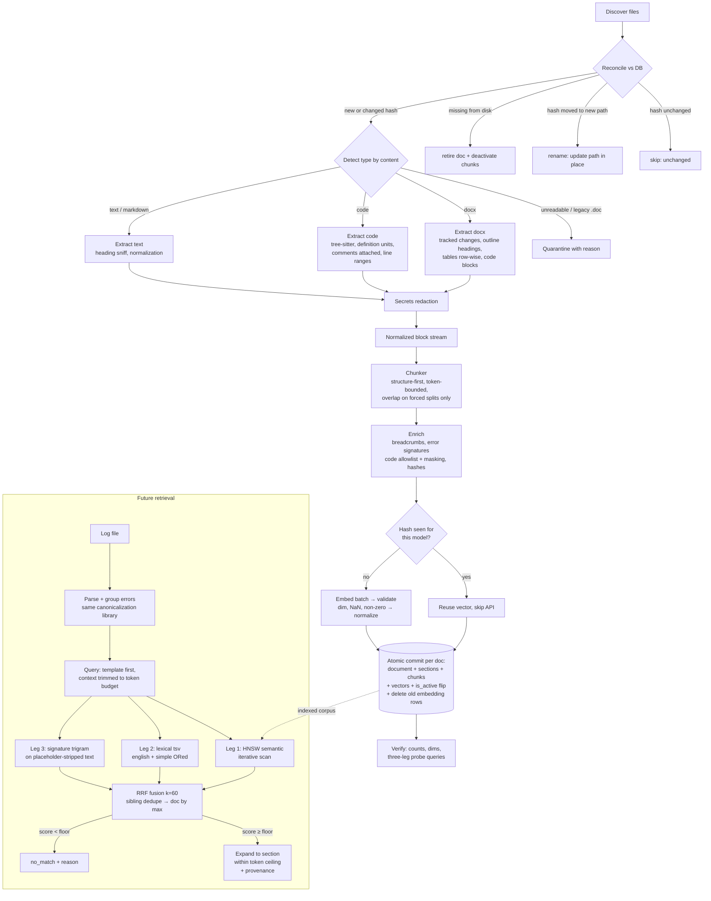

# Ingestion Flow Design v3 — Troubleshooting Guides

**Scope:** ingest troubleshooting guides in **docx** and **code** (Python, C#, Shell, C/C++), with generic text supported through the same path. Chunk, embed into **PostgreSQL + pgvector**, and structure the index so the future retrieval pipeline — *parse a log file → group errors → semantic + lexical + signature search → best-matching guide* — can map any hit back to its parent section and document.

Tunable values are marked `‹LIKE_THIS›`. **Requires pgvector ≥ 0.8** (iterative index scans are load-bearing for filtered queries — see §10).

**Changes vs. v2:** golden set is now a prerequisite (§0); secrets redaction added to extraction (§3.0); lexical query/index config mismatch fixed (§7, §10.2); error-code canonicalization no longer masks semantic codes (§5); trigram matching on residual text, not placeholder soup (§5, §10.2); query-side token bounding (§10.1); section-expansion ceiling (§10.3); rename detection in reconciliation (§2); embedding-row GC at supersede time + reindex policy (§6); fixed indexes and advisory-lock keyspace (§7, §2); content-loss test corrected (§12); per-model table access via swappable view (§7).

---

## 0. Golden set (prerequisite — build before tuning anything)

Every ‹tunable› below (chunk sizes, `ef_search`, fusion weights, no-match floor, signature similarity threshold) is tuned against a **golden evaluation set**, so it gets built first, not last:

- **Source:** mine ‹100–200› real incident log excerpts (or realistic synthetics generated from the corpus's quoted errors), each paired with the guide/section a domain expert confirms as the correct answer. Include ‹10–20› deliberate "no correct answer exists" queries to tune the no-match floor.
- **Composition mirrors production:** noisy multi-line errors, stack traces, errors with volatile values (IPs, ports, timestamps), and a spread across formats (docx-sourced and code-sourced answers) and languages.
- **Metrics:** recall@5 and MRR at the **document** level, plus section-level hit rate for small-to-big; per-leg recall to detect a single leg silently dying.
- **Lifecycle:** versioned alongside the corpus; re-run on every chunking/model/fusion change. A tunable changed without a golden-set run is a regression waiting to happen.

---

## 1. Pipeline overview

```
discover & reconcile files (incl. rename detection)
   → detect type (magic bytes, not extension)
      → extract to normalized block model (incl. secrets redaction)
         → chunk (structure-first, token-bounded)
            → enrich (breadcrumbs, error signatures, hashes)
               → embed (batched, validated, idempotent per model)
                  → store (transactional: doc + sections + chunks + vectors)
                     → verify (counts, dims, three-leg probe queries)
```

Three principles drive the design:

1. **Normalize before chunking.** Every format converts to one internal representation — an ordered list of *blocks* (`heading(level)`, `paragraph`, `table`, `code(language)`, `list_item`) plus a structure path. The chunker has one job regardless of source. Adding PDF/HTML later = one new extractor, not a new pipeline. The normalized block stream is also the reference for content-loss testing (§12) — not the raw file, since extraction deliberately drops boilerplate.
2. **Chunking is index-time-permanent; retrieval is not.** Changing chunk strategy means re-embedding the corpus, so chunking is conservative and metadata-rich. Everything needed to change *retrieval* behavior later (section links, line ranges, signatures, raw text) is stored now.
3. **Design the index for log-driven queries.** The future query is a noisy error line, not a well-formed question. The index therefore carries (a) breadcrumbed embeddings for semantic match, (b) weighted full-text for lexical match — **queried with a config that matches how each chunk was indexed**, and (c) **canonicalized error signatures that preserve semantic error codes** — the highest-precision signal a log query has.

---

## 2. Discovery & type detection

**Reconciliation (don't skip this).** Discovery produces these sets, and all are handled:
- on disk, not in DB (or `doc_hash` changed) → ingest / re-version
- on disk, unchanged hash → `skipped_unchanged`
- in DB, no longer on disk → candidate for retirement, **but first check for a rename**
- **Rename detection:** if, within one reconciliation pass, a `doc_hash` appears both as a new path and as a missing old path, that's a **move, not a delete+create**. Update `source_path` in place (record the old path in `alias_paths`); version history and chunk IDs stay continuous. Only after rename matching do remaining missing files get marked `retired` (chunks `is_active = false`). Don't hard-delete immediately — GC on a schedule (§6).

**Detection by content, never extension:**
- `PK\x03\x04` zip header containing `word/document.xml` → docx. A renamed legacy `.doc` (`D0 CF 11 E0`) is **rejected with a clear error**, not garbage-extracted.
- Code: extension is the primary signal (`.py .cs .sh .c .cc .cpp .h .hpp`), verified as valid text; shebang check (`#!/bin/bash`, `#!/usr/bin/env python`) for extensionless scripts.
- Readable text that isn't code → generic text; sniff Markdown headings (`^#{1,6} `) to enable structural chunking.
- Binary that matches nothing → **quarantine with reason**, `format = 'unknown'` (the column is NOT NULL; quarantined rows need a legal value). Nothing is silently skipped (§11 invariant).

**Concurrency:** ingestion takes `pg_advisory_xact_lock(‹INGEST_NS›, hashtextextended(source_path, 0)::int)` — or the single-key form with `hashtextextended` for the full 64-bit space. The v2 `hashtext()` was int32: collision-prone and sharing its keyspace with any other advisory-lock user in the database. Use the two-key form with a dedicated namespace constant so ingestion locks can't collide with anything else.

---

## 3. Extraction per format

### 3.0 Secrets redaction (all formats, before chunking)

Troubleshooting corpora — especially shell scripts and config snippets — are notorious for embedded credentials, connection strings, API keys, and tokens. Anything that survives extraction gets embedded, indexed, and served to whoever's log query lands nearby. So:

- Run a redaction pass over the normalized block stream using gitleaks-style patterns: `password=`, `PWD=`, AWS key shapes (`AKIA...`), bearer tokens, private-key headers, connection-string credentials (`user:pass@host`).
- Replace matches with typed placeholders (`<REDACTED:password>`) so the surrounding instruction text stays useful ("set `<REDACTED:password>` in the env file" still retrieves fine).
- Flag affected chunks `quality_flags += {redacted}` and report per-file redaction counts in observability (§11). High counts on a file → human review; it may be a credentials dump, not a guide.

### 3.1 docx

Two implementation traps to handle up front:

- **Tracked changes are not free.** `python-docx` iterates `paragraph.runs`, which *skips runs nested in `w:ins` and includes `w:del` remnants inconsistently* — "accept tracked changes" silently loses inserted text if you rely on it. Either (a) pre-process the XML: keep `w:ins` content, drop `w:del`/`w:moveFrom`, or (b) normalize the file first via headless LibreOffice (`soffice --convert-to docx`), which flattens revisions. Pick one and add a fixture with tracked changes to the test corpus (§12).
- **Heading detection must use outline level, not style names.** `style.name == "Heading 1"` breaks on localized templates (`Überschrift 1`, `Rubrik 1`) and customized styles. Use the style's built-in style ID / `w:outlineLvl` instead.

Then extract:
- **Heading hierarchy** → section path (`"DB Guide > Connection Errors > Pool Exhaustion"`). This is the most valuable structure in the file; troubleshooting guides are heading-organized (Symptom / Cause / Resolution).
- **Paragraphs and lists**, preserving list grouping — a numbered resolution procedure must never be torn apart mid-list.
- **Tables** → row-wise serialization (`column: value` per row, or Markdown pipe-tables for small tables). Raw cell concatenation destroys meaning, and guides love error-code/meaning tables — these rows also feed signature extraction (§5).
- **Code blocks inside docx** (style `Code` / monospace runs) → tagged `code` blocks so the chunker keeps them intact.
- Drop comments, headers/footers (per-page boilerplate pollutes every chunk). Images → placeholder `[image: <alt or "diagram">]`; **image-only documents are flagged `quarantined: no_text`** rather than indexed empty (OCR out of scope v1).

### 3.2 Code (Python, C#, Shell, C/C++)

Chunks align with **semantic units**, not blind token windows — a function split mid-body embeds as noise.

- **tree-sitter** with grammars for all four languages: one mechanism, and it produces a usable tree even for broken code (snippets in guides often don't compile). Python's stdlib `ast` is a fallback but rejects invalid code; tree-sitter degrades gracefully.
- Split on **top-level definitions**: functions; classes (per-method if large, class name in the breadcrumb); for C/C++ also `struct`/`enum`/macro groups.
- **Docstrings and leading comments stay attached** to their definition — in troubleshooting corpora, comments often carry more retrieval signal than the code.
- **File preamble** (module docstring, license, `import`/`using`/`#include` block) → one small chunk; imports say what the file touches.
- **Shell** scripts often have no functions → split on comment-delimited sections (`# --- step 2: restart service ---`) and blank-line groups, token-bounded.
- **C/C++ headers** → chunk by declaration group with doc comments; link to the matching `.c/.cpp` via `related_file` metadata rather than merging.
- Record `start_line`/`end_line` for every code chunk — retrieval will cite "guide X, lines 120–164".
- **Minified/generated code** (avg line length threshold) → token-split, flag `low_quality_structure`.

### 3.3 Generic text

Markdown headings → same section-path treatment as docx. Unstructured → paragraph-grouped token-bounded fallback (§4). Normalize everything: strip BOM, CRLF→LF, NFC unicode, collapse >2 blank lines, decode with detection (`charset-normalizer`) and log replacement counts.

---

## 4. Chunking — structure-first, token-bounded

Pure section chunking yields wildly variable sizes; pure token chunking severs semantic units. The hybrid:

### 4.1 Parameters

| Parameter | Value | Rationale |
|---|---|---|
| target size | ‹350–450› tokens | big enough for symptom+cause, small enough to stay on-topic |
| hard max | ‹512› (≤ model max) | **measured on `text_for_embed`, i.e. breadcrumb included** — never exceed; some APIs truncate silently |
| breadcrumb budget | ‹≤ 40› tokens | deep paths elide middle levels: `Guide > … > Resolution` |
| min size | ‹60› tokens | smaller → merge with sibling under same heading |
| overlap | ‹15%› (~50–80 tok), **forced splits only** | §4.4 |
| token counter | the embedding model's tokenizer **if locally available**; otherwise a stated approximation (e.g. `cl100k_base`) **with the hard max padded by ‹10%›** to absorb approximation error | counting with the wrong tokenizer is a classic silent bug; if approximating, say so explicitly and pad — never assume the vendor's count matches yours |

### 4.2 Algorithm

1. Walk the block stream; group blocks under their **deepest heading** → candidate sections.
2. Section within `[min, max]` → it *is* a chunk. Semantic boundary; no overlap.
3. Section > max → **recursive split**: sub-heading → paragraph → sentence → token window (last resort). Overlap applies only here. Never split inside a table row, list item, or code block — these move whole or become their own chunk.
4. Section < min → merge with the next sibling under the same parent heading; never merge across H1/H2 boundaries (that's how "DNS errors" leaks into "Disk errors" chunks).
5. Code: §3.2 unit splitting first, then size rules. An oversized function splits at statement boundaries, **repeating signature + docstring atop every sub-chunk** (the code analogue of a breadcrumb; code gets no token overlap beyond this).

### 4.3 Breadcrumb prefix

Prepend structural context to the **embedded** text only:

```
[Postgres Connection Troubleshooting > Pool Exhaustion > Resolution]
1. Increase max_connections ...
```

A bare "Increase the limit and restart the service" is unretrievable; with the breadcrumb it matches "postgres pool exhaustion fix". Store `text` (display) and `breadcrumb` **separately**; `text_for_embed = breadcrumb + "\n" + text` is what gets embedded.

The breadcrumb does **not** get full weight in the lexical index. If heading terms enter every chunk's tsvector at equal weight, a query containing title words lights up all siblings equally — the same "near-duplicates wasting fusion slots" failure overlap causes on the vector side. §7 uses `setweight`: body = `A`, breadcrumb = `C`.

### 4.4 Overlap rules

- Forced mid-section splits: **yes, ~15%** — protects against the answer straddling a cut.
- Natural section boundaries: **no** — bleeds topic A into topic B and produces duplicate hits.
- Code: **no token overlap**; repeated signatures are the overlap.
- Overlapped chunks carry `is_continuation` + `split_group_id` so retrieval can dedupe siblings from one split group.

### 4.5 Parent–child (small-to-big)

Embed and search **small chunks** (precise matching); return the **parent section** to the answer composer (rich context) — **with a ceiling** (§10.3): an 8,000-token mega-section must not nuke the composer's context budget. Sections are first-class rows (§7) storing their full text and a precomputed `token_count` — `chunk.section_id → sections.text` is a single lookup, not a reconstruction, and the expansion decision (`section vs. chunk + adjacent siblings`) is a cheap comparison against the stored count.

---

## 5. Error-signature extraction (built for log-based retrieval)

The future query is a raw log error. The single highest-precision link between a log line and a guide is the **error string/code the guide itself quotes**. Mine these at ingest:

1. **Detect** error-like lines in guide text and tables: regexes for `ERROR|FATAL|Exception|errno|E[A-Z]{3,}|0x[0-9A-Fa-f]+|HTTP [45]\d\d|stack-frame patterns`, plus the value column of error-code tables.
2. **Canonicalize** each into a *template* — masking volatile parts **while preserving semantic error codes**:
   - **Mask (volatile):** timestamps→`<TS>`, UUIDs→`<UUID>`, file paths→`<PATH>`, IPs→`<IP>`, quoted identifiers→`<ID>`, ports/PIDs/sizes/line numbers→`<NUM>`, non-code hex (addresses, hashes)→`<HEX>`.
   - **Preserve (semantic, via allowlist — applied *before* the generic numeric masks):** HTTP status codes (`HTTP [45]\d\d`), `errno` values and names (`errno 111`, `ECONNREFUSED`), Windows HRESULTs (`0x8007....`), SQLSTATEs (`23505`), vendor codes (`ORA-\d+`, `MSB\d+`, `E\d{4}`, `CS\d{4}`). These codes *are* the signal — v2 masked `HTTP 503` into `HTTP <NUM>`, making a 503 guide and a 404 guide identical templates and destroying the leg's precision. The allowlist is config, expected to grow as the corpus reveals new code families.
   - Example: `connection to server at "10.2.3.4", port 5432 failed: FATAL: too many connections` → `connection to server at <IP>, port <NUM> failed: FATAL: too many connections` — but `HTTP 503 Service Unavailable from <IP>` keeps its `503`.
3. **Store** in `chunk_error_signatures` as three columns: `raw`, `canonical` (masked template, for display/debug), and `match_text` — **the canonical template with placeholders stripped** (or collapsed to a single sentinel char). Trigram similarity runs on `match_text`: placeholder tokens like `<NUM>`/`<IP>` are shared trigrams that inflate similarity between unrelated errors — two different errors with three placeholders each look "similar" for no reason. The trigram index goes on `match_text` (§7), and `pg_trgm.similarity_threshold` is tuned on the golden set (the 0.3 default is generous).

At query time the log pipeline applies the **same masking and stripping** (one shared library — the contract both sides import, never two implementations) and signatures match `match_text`-to-`match_text`. This is the third leg of fusion (§10).

---

## 6. Versioning, idempotency, lifecycle

- **Document versions:** changed `doc_hash` → insert `version+1`, mark old `superseded` (don't delete the chunk/section *rows*; in-flight queries may hold chunk ids). Retrieval filters on the chunk-level `is_active` flag (denormalized — see §7 for why). GC superseded/retired rows on a schedule.
- **Embedding rows are the exception — delete them at supersede time.** HNSW handles deletes poorly (tombstones, no real space reclaim), so corpses degrade scan quality and bloat the index quietly. Since the hash-reuse mechanism *copies* vectors to the new version's rows, the old version's embedding rows have no readers the moment `is_active` flips — delete them in the same transaction. Pair with a scheduled `REINDEX INDEX CONCURRENTLY` policy (trigger: ‹dead-tuple ratio > 20%› on the embedding table) to reclaim HNSW space on a corpus with frequent guide updates.
- **Idempotency key = `(content_hash, embedding_model)`**, not `content_hash` alone — after a model upgrade, old-model hashes must not short-circuit re-embedding. A hash hit skips the **embedding API call**; the chunk row is still inserted for the new document version (text copied, vector reused).
- **Transactional per document:** stage sections + chunks + vectors, commit atomically with the document row, flip `is_active` old→new (and delete old embedding rows) in the same transaction. A crash leaves the previous version or nothing — never half a guide ("found the Symptom section but Resolution doesn't exist" bugs masquerade as relevance problems).
- **Duplicates** (same `doc_hash`, different paths, simultaneously present): ingest once, record alias paths — duplicates occupy multiple fusion slots with identical content. **Moves over time** are handled by rename detection in reconciliation (§2), not by the alias mechanism.

---

## 7. Schema

Key structural choices: **(a)** sections are real rows with stored token counts, **(b)** embeddings live in **per-model tables** (a fixed `vector(D)` column physically cannot hold a different-dimension model; per-model tables also make cutover atomic and remove a WHERE filter from the hot query) — accessed through a **swappable view** so the hot query never string-interpolates table names, **(c)** `is_active` is denormalized onto chunks so the vector query needs no join to `documents`, **(d)** the tsvector is weighted and config-aware — and the *query side* respects the same config split (§10.2), **(e)** expensive indexes are partial on `is_active` instead of a useless single-column boolean index.

```sql
CREATE EXTENSION IF NOT EXISTS vector;     -- ≥ 0.8
CREATE EXTENSION IF NOT EXISTS pg_trgm;

CREATE TABLE documents (
  document_id  uuid PRIMARY KEY,
  source_path  text NOT NULL,
  alias_paths  text[] NOT NULL DEFAULT '{}',   -- duplicates + historical paths from renames
  title        text,
  format       text NOT NULL,              -- docx | code | text | unknown (quarantined binaries)
  doc_hash     text NOT NULL,
  version      int  NOT NULL DEFAULT 1,
  status       text NOT NULL DEFAULT 'active',  -- active|superseded|retired|quarantined
  ingested_at  timestamptz DEFAULT now(),
  retired_at   timestamptz,
  UNIQUE (source_path, version)
);

CREATE TABLE sections (                    -- small-to-big targets
  section_id        uuid PRIMARY KEY,
  document_id       uuid NOT NULL REFERENCES documents ON DELETE CASCADE,
  parent_section_id uuid REFERENCES sections,
  section_path      text[] NOT NULL,       -- ['Postgres Guide','Pool Exhaustion']
  heading           text,
  depth             int NOT NULL,
  section_order     int NOT NULL,
  text              text NOT NULL,         -- full section text, denormalized for cheap expansion
  token_count       int  NOT NULL          -- precomputed: drives the §10.3 expansion ceiling
);

CREATE TABLE chunks (
  chunk_id        uuid PRIMARY KEY,
  document_id     uuid NOT NULL REFERENCES documents ON DELETE CASCADE,
  section_id      uuid REFERENCES sections,
  chunk_index     int  NOT NULL,
  text            text NOT NULL,           -- raw, for display
  breadcrumb      text NOT NULL DEFAULT '',
  text_for_embed  text NOT NULL,           -- breadcrumb + text (what was embedded)
  token_count     int  NOT NULL,           -- measured on text_for_embed, §4.1 tokenizer
  block_types     text[],
  language        text,                    -- python|csharp|shell|c|cpp for code
  start_line int, end_line int,
  related_file    text,                    -- .h ↔ .c pairing
  is_continuation bool NOT NULL DEFAULT false,
  split_group_id  uuid,
  content_hash    text NOT NULL,           -- sha256(text_for_embed)
  is_active       bool NOT NULL DEFAULT true,   -- denormalized from documents.status
  quality_flags   text[],                  -- e.g. {low_quality_structure, redacted}
  created_at      timestamptz DEFAULT now(),
  tsv tsvector GENERATED ALWAYS AS (
        setweight(to_tsvector(
          CASE WHEN language IS NOT NULL THEN 'simple'::regconfig   -- don't stem code identifiers
               ELSE 'english'::regconfig END, text), 'A')
     || setweight(to_tsvector('simple', breadcrumb), 'C')           -- discounted, not absent
  ) STORED
);
-- Partial on is_active: keeps the GIN small and skips superseded rows for free.
-- (v2 had `CREATE INDEX ... ON chunks (is_active) WHERE is_active` — a partial index whose
--  only column is its own predicate indexes a constant; dropped.)
CREATE INDEX chunks_tsv_gin ON chunks USING gin (tsv) WHERE is_active;
CREATE INDEX chunks_doc     ON chunks (document_id, chunk_index);
CREATE INDEX chunks_hash    ON chunks (content_hash);

CREATE TABLE chunk_error_signatures (      -- §5; precision leg
  signature_id uuid PRIMARY KEY,
  chunk_id     uuid NOT NULL REFERENCES chunks ON DELETE CASCADE,
  raw          text NOT NULL,
  canonical    text NOT NULL,              -- masked template (display/debug)
  match_text   text NOT NULL               -- canonical with placeholders stripped — what trigram sees
);
CREATE INDEX sig_trgm ON chunk_error_signatures USING gin (match_text gin_trgm_ops);

CREATE TABLE embedding_models (            -- registry; exactly one default
  model_name text PRIMARY KEY,             -- 'voyage-3@2025-01' — pin name@version
  dim        int  NOT NULL,
  table_name text NOT NULL,
  is_default bool NOT NULL DEFAULT false
);

-- One table per model; dim baked in. Model upgrade = new table + backfill + atomic cutover.
CREATE TABLE chunk_embeddings_‹model_slug› (
  chunk_id  uuid PRIMARY KEY REFERENCES chunks ON DELETE CASCADE,
  embedding vector(‹1536›) NOT NULL        -- MUST equal model output dim; verify model is cosine-trained
);
CREATE INDEX emb_‹model_slug›_hnsw ON chunk_embeddings_‹model_slug›
  USING hnsw (embedding vector_cosine_ops) WITH (m = 16, ef_construction = ‹64›);

-- The hot query reads a stable name; cutover (§9) swaps what's behind it — no dynamic SQL,
-- no table-name string interpolation in application code.
CREATE VIEW chunk_embeddings_default AS
  SELECT chunk_id, embedding FROM chunk_embeddings_‹model_slug›;
```

Notes:
- Query operator **must** match the opclass: `<=>` with `vector_cosine_ops`.
- **Initial bulk load:** insert rows first, build the HNSW index after, with `maintenance_work_mem` raised and parallel workers — far faster than incremental maintenance.
- Multilingual corpora later: add a `lang` column and per-language ts configs ‹future›.

---

## 8. Embedding step

- **Batch** ‹64–128› chunks/call; retry with exponential backoff; on partial batch failure retry items individually, quarantine persistent failures, ingest the rest.
- **Validate every vector:** `len == embedding_models.dim`, no NaN/inf, not all-zero. Reject the chunk, not the batch. Dimension mismatch → hard fail naming model + expected/actual.
- **Normalize to unit length** before storing — cosine ops don't require it, but it keeps inner-product ops open later for free.
- Idempotency and transactionality per §6.

---

## 9. Model upgrades

1. Register the new model in `embedding_models`; create its `chunk_embeddings_<new>` table + HNSW index (built after backfill).
2. Backfill all `is_active` chunks (hash short-circuit doesn't apply across models, by design of the §6 key).
3. Cut over atomically in one transaction: flip `is_default` **and** `CREATE OR REPLACE VIEW chunk_embeddings_default` to point at the new table — retrieval reads the new model with no application change.
4. GC the old table after a soak period (golden-set comparison old vs. new before GC). **Two models never coexist in one searched index** — mixed-model vectors are not comparable and the failure mode is invisible (just quietly bad results).

---

## 10. Retrieval design (build later, designed now)

The future pipeline: **log file → parse → group errors → query → fused search → guide**.

### 10.1 Log side

1. **Parse & classify** log lines; isolate error/fatal/exception lines plus stack traces.
2. **Group** repeated errors into templates using the **same canonicalization library as §5** (shared code, not parallel implementations — the masks and the allowlist must drift together or not at all). A log with 10,000 occurrences of one error becomes one query group with a count. (A template miner like Drain works here; the §5 library is the contract both sides share.)
3. Per group, build the query: **canonical error template first, then representative context lines, token-bounded to the embedding model's max with the same §4.1 tokenizer.** The v2 spec said "template + ±50 lines of context" — fifty log lines is easily 1,500+ tokens, recreating on the query side the exact silent-truncation failure §11 forbids on the ingest side. Budget: template is never trimmed; context is trimmed innermost-out to fit ‹512› tokens. Embed with the model behind `chunk_embeddings_default`; enforce the model check at query time.

### 10.2 Three legs over the same chunk set

```sql
-- (1) semantic
SET hnsw.iterative_scan = relaxed_order;   -- pgvector ≥ 0.8: keeps scanning until LIMIT is satisfied
SET hnsw.ef_search = ‹100›;                -- tune on golden set; mind hnsw.max_scan_tuples
SELECT c.chunk_id, e.embedding <=> $qvec AS dist
FROM chunk_embeddings_default e JOIN chunks c USING (chunk_id)
WHERE c.is_active
ORDER BY e.embedding <=> $qvec LIMIT 50;

-- (2) lexical — query config must mirror the index config.
-- Prose chunks were indexed with 'english' (stemmed); code chunks with 'simple' (unstemmed).
-- A single english-config query ("connections" → "connect") can NEVER match the unstemmed
-- "connections" in a simple-config tsvector — the v2 query was silently blind to code chunks.
-- So: run both configs and take the union (or OR the tsqueries):
SELECT chunk_id, ts_rank_cd(tsv, q) AS score
FROM chunks,
     LATERAL (SELECT websearch_to_tsquery('english', $qtext)
              || websearch_to_tsquery('simple',  $qtext) AS q) _
WHERE is_active AND tsv @@ q
ORDER BY score DESC LIMIT 50;

-- (3) error-signature (placeholder-stripped template vs. same on the query side)
SELECT s.chunk_id, similarity(s.match_text, $query_match_text) AS score
FROM chunk_error_signatures s JOIN chunks c USING (chunk_id)
WHERE c.is_active AND s.match_text % $query_match_text   -- pg_trgm.similarity_threshold ‹tuned›
ORDER BY score DESC LIMIT 50;
```

Without `iterative_scan`, post-filtering on an HNSW scan silently under-returns (a selective filter over the default candidate set can yield far fewer rows than `LIMIT`, or zero). That, plus the join to a filtered table, is why pgvector ≥ 0.8 is a hard requirement.

### 10.3 Fusion & aggregation

1. **RRF** (`k ≈ 60`) across the three lists. The signature leg is the precision anchor: a strong template match on a rare error code should beat generic semantic similarity — with codes now surviving canonicalization (§5), this leg actually has the precision the design assumes. If golden-set evals agree, weight it higher in the fusion.
2. **Dedupe siblings:** chunks sharing a `split_group_id` count once (keep the best). Adjacent `chunk_index` is only a *secondary* heuristic and **requires a same-`section_id` guard** — two adjacent but distinct sections that both legitimately matched must not be collapsed into one.
3. **Chunk → document:** group by `document_id`; rank documents by **max** fused chunk score (sum biases toward long documents with many mediocre hits).
4. **Small-to-big with a ceiling:** expand winners via `section_id`. If `sections.token_count ≤ ‹1500›`, hand the composer the full section text; otherwise fall back to the winning chunk plus its adjacent siblings within the section, up to the same budget. Either way include provenance: `title`, `section_path`, `start_line..end_line` for code → "Guide: Postgres Troubleshooting › Pool Exhaustion › Resolution".
5. **Filters come free** in all three legs' WHERE clauses (`language = 'shell'`, `format = 'docx'`, future `system = 'payments'` tag).
6. **"No match" is a first-class answer:** best fused score below a floor ‹tune on golden set› → return `no_match + reason` instead of feeding a weak chunk to the composer (anti-hallucination rule).

---

## 11. Edge cases checklist

**Files & formats**
- Empty/whitespace-only → `quarantined: empty`, zero chunks, non-fatal.
- Renamed `.doc`, binary-as-`.txt` → magic-byte detection, quarantine with reason, `format = 'unknown'` where undetectable.
- Password-protected / corrupt docx → catch extractor exception, quarantine; never crash the batch.
- Image-only/scanned docx → `quarantined: no_text` (no OCR in v1; surfacing beats silently indexing an empty guide).
- Tracked-changes docx → §3.1 normalization; fixture-tested.
- Localized Word templates → outline-level heading detection (§3.1).
- Duplicate guides (simultaneous) → ingest once, alias paths.
- **Moved/renamed source files → rename detection in reconciliation (§2); path updated, history continuous.**
- **Deleted source files → retired via reconciliation (§2), after rename matching.**
- **Embedded secrets/credentials → redacted with typed placeholders, flagged, counted (§3.0).**
- Mixed/invalid encodings → detect, replace, log counts; strip BOM.
- Huge file (›‹5 MB› text) → stream extraction, cap chunks with warning; investigate (a log file masquerading as a guide).

**Chunking**
- Section over model max even after paragraph splits → sentence/token fallback; **never send an over-limit chunk to the embedder** (silent truncation = invisible data loss). Limit measured with breadcrumb included, padded if the tokenizer is approximate (§4.1).
- Deep heading paths → breadcrumb elision, ‹40›-token cap.
- Sub-min chunk with no sibling → attach to previous chunk.
- Heading with no body → not a chunk; survives in children's breadcrumbs.
- Procedure/list spanning max → split *between* items only, repeat breadcrumb, mark continuation.
- Wide tables → row-wise `column: value` so a row-level chunk stays self-describing.
- Syntax-error code → tree-sitter still yields a tree; worst case blank-line/token split. Never drop a file for a parse error.
- Minified/generated code → token-split + `low_quality_structure` flag.
- Zero-token chunk after normalization → drop, count it.

**Signatures**
- Semantic error codes (HTTP status, errno, HRESULT, SQLSTATE, vendor codes) → preserved via allowlist; volatile values masked (§5).
- Placeholder-heavy templates → trigram match on `match_text` (placeholders stripped), threshold tuned (§5).
- Guide quotes the same error in prose and in a table → both extracted; signature dedupe per chunk on identical `canonical`.

**Embedding & storage**
- Dim mismatch → hard fail with model + dims.
- Partial batch failure → individual retry → quarantine stragglers, ingest rest, report.
- Unchanged re-ingest → hash short-circuit (per-model key), zero API calls, zero new rows.
- Model upgrade → §9; never mix models in one searched set; cutover via view swap.
- Superseded versions → embedding rows deleted at flip time; periodic `REINDEX CONCURRENTLY` policy (§6).
- Concurrent runs → namespaced 64-bit advisory lock per `source_path` (§2).
- **Query side over model token limit → template-first trimming, never silent truncation (§10.1).**
- **Oversized parent section at retrieval → expansion ceiling, sibling fallback (§10.3).**

**Observability** — per file, per run: `{file, status: ingested|quarantined|skipped_unchanged|retired|renamed, reason, chunks_created, chunks_quarantined, signatures_extracted, redactions, tokens_embedded, duration}`. Batch invariant: **ingested + quarantined + skipped + retired + renamed == union(discovered, previously_active)**. Nothing disappears silently.

---

## 12. Acceptance tests

1. **Fixture corpus:** docx with headings+table+embedded code+image; docx **with tracked changes**; docx from a **non-English template**; `.py` with classes/functions/docstrings; `.sh` without functions **containing a fake credential** (redaction fixture); `.c`+`.h` pair; `.cs`; plain `.txt`; Markdown; empty file; renamed binary; duplicate pair; a fixture guide quoting a realistic error line **including an HTTP status code and an errno**.
2. **Extraction:** section paths correct; table rows readable; tracked changes resolved to final text; localized headings detected; code chunks on definition boundaries with docstrings attached; **fake credential replaced by typed placeholder and chunk flagged `redacted`**.
3. **Chunk invariants** (property tests): `min ≤ token_count ≤ max` (or flagged); no chunk crosses an H1/H2 boundary; no split inside code block/table row/list item; breadcrumb present in `text_for_embed` and within budget; **concatenated chunk texts ⊇ the normalized block stream** (v2 asserted ⊇ the *original file*, which fails by design — headers, footers, comments, and images are deliberately dropped; the reference is the post-extraction stream); every chunk's `section_id` resolves and the section text contains the chunk text; `sections.token_count` matches a recount.
4. **Storage:** row counts match expectations; vector dims match registry; HNSW + partial GIN + trgm indexes exist; FK integrity; `is_active` consistent with document status; `chunk_embeddings_default` view resolves to the `is_default` model's table.
5. **Round-trip probes — one per leg, prose *and* code:** (a) embed a verbatim fixture sentence → rank 1 by `<=>`; (b) tsquery of a prose chunk's rare terms → that chunk; **(b′) tsquery of a code chunk's identifier (e.g. `max_connections`) → that chunk — this is the probe that catches the english-vs-simple config mismatch, which v2's prose-only probe would have shipped green**; (c) mask a synthetic log line matching the fixture's quoted error → signature leg returns that chunk; **(c′) two synthetic errors differing only in their HTTP status code → signature leg ranks the matching-code chunk strictly above the other (verifies the allowlist)**.
6. **Filtered-recall probe:** with a selective filter, the vector leg still returns `LIMIT` rows (verifies iterative scan config — the silent-under-return failure mode).
7. **Dedupe probe:** a query landing on a split group returns it once after sibling dedupe; **a query matching two adjacent but distinct sections returns both** (verifies the same-section guard).
8. **Idempotency:** second run → zero embedding calls, zero new rows. **Model-upgrade dry run:** hash short-circuit does *not* fire across models; view swap flips retrieval atomically.
9. **Crash safety:** kill mid-document → previous version or nothing; never partial.
10. **Lifecycle:** delete a source file, re-run → document retired, chunks inactive, gone from all three legs; **move a source file, re-run → same document_id, path updated, status `renamed` in the run report, zero re-embedding**; supersede a document → old embedding rows gone from the embedding table.
11. **Query-side bounding:** a synthetic log group with 200 context lines → query embed input ≤ ‹512› tokens, template intact at the front.
12. **Golden set gate:** recall@5 and MRR on the §0 set meet ‹baseline›; per-leg recall reported so a single dead leg is visible.

---

## 13. Defaults summary

| Decision | Default | Revisit when |
|---|---|---|
| Golden set | ‹100–200› labeled log→guide pairs + no-match cases, built **before** tuning | corpus or log mix shifts |
| Chunking | structure-first, token-bounded hybrid | corpus turns out structureless |
| target / max / min | ‹400 / 512 / 60› tokens, breadcrumb included; model tokenizer or stated approximation + ‹10%› pad | golden-set recall says otherwise |
| Overlap | 15% on forced splits only; none at section boundaries | answers straddle sections often |
| Breadcrumb | always; ‹≤40› tok; weight `C` in tsv, body `A` | — |
| Parent-child | embed chunks, return sections, **‹1500›-token expansion ceiling with sibling fallback** | composer needs more/less context |
| Code splitting | tree-sitter, definition-level, comments attached, repeated signatures | only snippets, never full files |
| Secrets | gitleaks-style redaction pre-chunking, typed placeholders, `redacted` flag | corpus is verified credential-free |
| Error signatures | masked templates **with semantic-code allowlist**; trigram on placeholder-stripped `match_text`; shared canonicalization library | guides quote no error strings |
| Vector index | HNSW cosine, per-model tables behind a default view, `iterative_scan=relaxed_order`, `ef_search` ‹100›; embedding rows deleted at supersede + periodic reindex | corpus ≫ 1M chunks |
| Lexical | weighted generated tsvector, partial on `is_active`; `simple` for code, `english` for prose; **query ORs both configs** | multilingual corpus |
| Fusion | RRF k=60 over 3 legs; doc rank by max chunk; split-group dedupe (adjacency only with same-section guard); no-match floor | golden-set evals |
| Updates | per-model hash skip, version+supersede, retire on delete, **rename detection**, namespaced 64-bit advisory locks, atomic per doc | — |
| OCR / images | out of scope; quarantine image-only docs | scanned guides matter |

---

## 14. System flowchart


