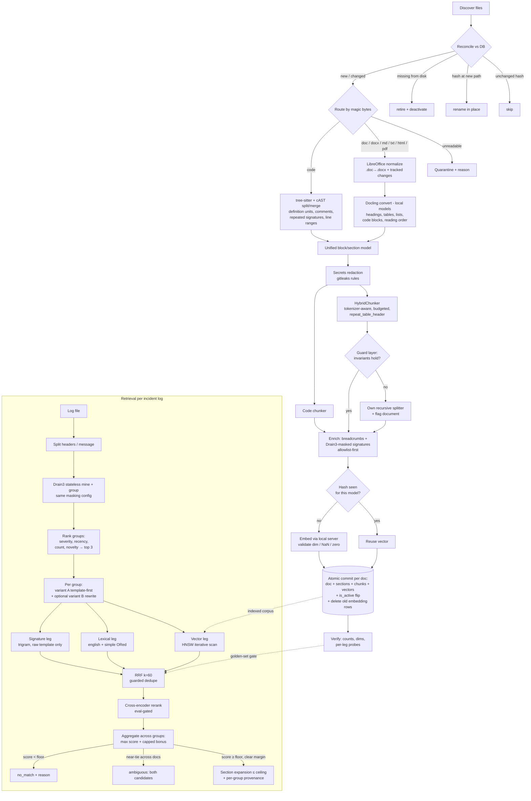

# Ingestion & Retrieval System v5 — Troubleshooting Guides (Phased, Library-First, Air-Gap-Clean)

**Scope:** ingest troubleshooting guides (docx — including legacy .doc — code in Python/C#/Shell/C/C++, and generic text; PDF/HTML/Markdown fall out for free), index into PostgreSQL + pgvector, and serve a log-driven retrieval pipeline: *log file → parse & group errors → rank groups → hybrid search per group → rerank → aggregate → best guide section, or an explicit no-match*.

**What changed from v4** (full rationale in the companion review, `pipeline-review-v5.md`):

1. The design is now **sequenced into eval-gated phases** (§13) instead of being a monolithic final state. The reranker and the new LLM query-rewrite stage are candidates that must pay rent on the golden set, not assumed architecture.
2. The **query side is now fully specified**: error-group ranking, per-group retrieval with document-level aggregation, an optional LLM query-rewrite variant for the log-register vs. guide-prose vocabulary mismatch, and a calibrated no-match policy with a margin-based "ambiguous" outcome (§9).
3. The code chunker is built **as the cAST algorithm** (published, evaluated) plus our invariants, not invented from scratch (§4.2).
4. Legacy `.doc` is **converted, not quarantined** (§3).
5. The embedding model decision is a **Phase-0 bake-off** with named candidates and constraints (§7).
6. The lexical leg's **BM25 escape hatch** is named with its trigger condition (§8).
7. A **deployment & packaging design** for on-prem air-gapped delivery, including the single-process SQLite fallback profile (§10). Every model and dependency is local; nothing in the runtime path touches a network.

**Design rules for v5:**

- *Buy the commodity, build the differentiator.* Components tagged **[LIB]**, **[LIB+GUARD]**, or **[BUILD]** as in v4.
- *Every optional quality stage is eval-gated.* It ships behind a config flag and is dropped if golden-set uplift is below its threshold.
- *Air-gap-clean by construction.* No hosted APIs anywhere in the pipeline; all models self-hosted and vendored in the install bundle; no runtime downloads.

Tunables marked `‹LIKE_THIS›`. Requires **pgvector ≥ 0.8** (iterative index scans), **Docling ≥ 2.x** (models pre-fetched and bundled), **Drain3**, **tree-sitter** grammars for the five languages, self-hosted embedding + reranker weights.

---

## 0. The build-vs-buy ledger

| Concern                                                                                | Owner                                                         | Why                                                                                                                                                                                                                                                                                                                                |
| -------------------------------------------------------------------------------------- | ------------------------------------------------------------- | ---------------------------------------------------------------------------------------------------------------------------------------------------------------------------------------------------------------------------------------------------------------------------------------------------------------------------------- |
| docx/.doc/PDF/HTML/MD extraction, layout, tables, reading order                        | **[LIB]** Docling                                             | LF AI & Data project; state-of-the-art structure recovery (headings, tables incl. multi-level headers, lists, code, captions); excludes headers/footers; one extractor for every prose format. Layout/table models **vendored locally** — Docling must never reach for HuggingFace at runtime                                      |
| Tracked-changes + legacy `.doc` normalization                                          | **[BUILD]** (tiny)                                            | One LibreOffice headless pre-pass does both: flattens revisions *and* converts `.doc → .docx`. Fixture-verified, not assumed                                                                                                                                                                                                       |
| Prose chunking                                                                         | **[LIB+GUARD]** Docling HybridChunker                         | Tokenizer-aware (real tokenizer via `BaseTokenizer`), structure-preserving, `repeat_table_header=True` so table-spanning chunks keep their column names; our guard layer enforces the invariants it doesn't promise (incl. its documented undersized-tail-chunk behavior)                                                          |
| Code parsing/chunking                                                                  | **[BUILD]** = cAST algorithm on tree-sitter + our invariants  | `astchunk`/Chonkie now exist but lack C/C++/Shell coverage, signature repetition, docstring attachment, and line-range provenance. We implement the published cAST split-then-merge algorithm and layer our three invariants on top — transcription, not invention. Re-evaluate `astchunk` as a drop-in per language as it matures |
| Log template mining & masking                                                          | **[LIB]** Drain3                                              | Standard streaming miner (logpai-maintained); its MaskingInstructions config *is* the shared canonicalization contract between ingest and query side. Query-side use is **stateless** — fresh miner per log file, no snapshots (§9.1)                                                                                              |
| Error-signature allowlist                                                              | **[BUILD]** (config)                                          | "HTTP 503 must survive masking" is domain knowledge; ordered Drain3 masking instructions                                                                                                                                                                                                                                           |
| Embedding & rerank inference                                                           | **[LIB]** local model server (e.g. TEI / vLLM / ONNX runtime) | Self-hosted only — air gap eliminates hosted APIs. Batching, retries are the server's job; our guard validates outputs                                                                                                                                                                                                             |
| Query rewrite (optional)                                                               | **[LIB]** local LLM + **[BUILD]** prompt & gate               | One small local LLM call per top error group; eval-gated, dropped if uplift < threshold (§9.2)                                                                                                                                                                                                                                     |
| Storage & indexes                                                                      | **[BUILD]** SQL schema                                        | Per-model embedding tables, weighted/config-split tsvector, signature table, partial indexes, atomic cutover — no vector-store adapter expresses this                                                                                                                                                                              |
| First-stage retrieval (3 legs)                                                         | **[BUILD]** ~3 SQL queries                                    | Short, and their correctness details are the system's quality. Owning them is also what makes the BM25 swap (§8) and the SQLite port (§10.3) one-day jobs                                                                                                                                                                          |
| Fusion + group aggregation                                                             | **[BUILD]** ~80 lines                                         | RRF + document-level aggregation across error groups; trivial, but owning it keeps dedupe/weighting tunable                                                                                                                                                                                                                        |
| Reranking                                                                              | **[LIB]** bge-reranker-v2-m3 self-hosted                      | The practical 2026 baseline (lightweight, fast, multilingual). Step-ups if eval demands: Qwen3-Reranker (Apache-2.0, instruction-aware, slower), mxbai-rerank-large-v2. Hosted rerank APIs are **out** — air gap                                                                                                                   |
| Evaluation harness                                                                     | **[LIB+GUARD]** Ragas / custom runner on the golden set       | recall@k, MRR are commodity; per-leg recall and no-match precision reporting are ours                                                                                                                                                                                                                                              |
| Orchestration                                                                          | **[BUILD]** plain Python CLI; ‹Prefect/Temporal later›        | A nightly idempotent batch needs no workflow engine — and in an air gap, every piece of infrastructure not shipped is a piece that can't break                                                                                                                                                                                     |
| **Not used:** LangChain/LlamaIndex as the frame; managed vector DBs; hosted model APIs | —                                                             | See §12                                                                                                                                                                                                                                                                                                                            |

---

## 1. Phase 0 — Golden set + model bake-off (no library shortcut)

Built **before** tuning anything; every ‹tunable› downstream is meaningless without it.

- ‹100–200› real (or corpus-derived synthetic) incident-log excerpts, each labeled with the correct guide + section by a domain expert; plus ‹10–20› queries with **no** correct answer (these calibrate the no-match floor — §9.5 — not just decorate the eval).
- Mix mirrors production: multi-line stack traces, volatile values, prose-sourced and code-sourced answers, **multi-error logs whose groups point at the same guide** (exercises §9.4 aggregation).
- Metrics: recall@5 and MRR at document level, section-level hit rate, **per-leg recall** (a silently-dead leg must be visible), reranker uplift, rewrite uplift, **no-match precision/recall** on the labeled negatives.
- **Embedding bake-off, run once, here:** candidates must (a) not collapse on code, (b) be self-hostable with locally available tokenizers, (c) ideally support query-side instructions. Default candidate: **Qwen3-Embedding** (instruction-aware; query prefix "Instruct: given an error log template, retrieve the troubleshooting guide section that resolves it"). Conservative alternative: **bge-m3** (same family as the reranker; emits sparse signals if a fourth leg is ever wanted). The golden set picks the winner; the loser is never mass-embedded.
- Harness versioned with the corpus; re-run on every chunking/model/fusion/reranker change. CI gate: no regression below ‹baseline›.

---

## 2. Architecture overview

```
INGEST (nightly idempotent CLI)
discover & reconcile (rename-aware)                                  [BUILD]
  → route by type (magic bytes)                                      [BUILD]
     → prose (.docx/.doc/md/txt/html/pdf):
          LibreOffice normalize (.doc→.docx, flatten revisions)      [BUILD]
          → Docling → DoclingDocument                                [LIB]
     → code: tree-sitter → cAST split/merge → definition units       [BUILD]
        → unified block/section model                                [BUILD, thin]
           → secrets redaction (gitleaks rules)                      [LIB+GUARD]
              → chunking (HybridChunker / code chunker) + guards     [LIB+GUARD]
                 → enrich: breadcrumbs, Drain3-masked signatures     [LIB+BUILD]
                    → embed (local server, batched, validated)       [LIB+GUARD]
                       → store (atomic per doc, custom schema)       [BUILD]
                          → verify (counts, dims, 3-leg probes)      [BUILD]

RETRIEVE (per incident log)
log file → split headers/message → Drain3 (stateless) → templates
  → rank error groups (severity, recency, count, novelty) → top ‹3›
     → per group: query = template-first + trimmed context
        (+ optional LLM rewrite variant, eval-gated)
        → 3 legs (vector / lexical / signature) → RRF
           → cross-encoder rerank (eval-gated)
              → per-group ranked sections
  → document-level aggregation across groups
     → floor + margin check → answer / ambiguous / no_match
        → section expansion (ceiling) + provenance per group
```

Principles carried over unchanged because they were right:

1. **One internal representation** before chunking (produced mostly by Docling).
2. **Chunking is index-time-permanent** — conservative, metadata-rich; retrieval behavior stays changeable.
3. **The index is designed for log queries** — breadcrumbed embeddings, config-correct lexical, exact-ish signature matching.
4. *(new)* **The query side is designed for logs, not questions** — groups are ranked before retrieval, and results are aggregated across groups after it.

---

## 3. Discovery, reconciliation, lifecycle — [BUILD]

The layer no framework provides and where production RAG actually rots. Unchanged from v4 except the `.doc` route:

- **Reconcile** disk vs DB: new/changed hash → ingest/re-version; unchanged → skip; same hash at new path + missing old path in one pass → **rename** (update `source_path`, append `alias_paths`, IDs continuous); still missing after rename matching → **retire** (chunks `is_active=false`).
- **Versioning:** changed hash → `version+1`, old marked `superseded`; chunk `is_active` flips atomically with the new version's commit. **Embedding rows of the superseded version are deleted in the same transaction** (HNSW tombstones degrade scans) + scheduled `REINDEX CONCURRENTLY` at ‹dead-tuple ratio > 20%›.
- **Idempotency key = `(content_hash, embedding_model)`** — hash hit skips the inference call, never the row insert; never short-circuits across models.
- **Concurrency:** `pg_advisory_xact_lock(‹INGEST_NS›, hashtextextended(source_path,0)::int)`.
- **Atomic per document:** doc + sections + chunks + vectors + active-flag flip in one transaction. Crash → previous version or nothing.
- **Legacy `.doc` → convert, don't quarantine.** The LibreOffice pre-pass we already run for tracked changes converts `.doc → .docx` in the same invocation style. Old guides are disproportionately the rarely-seen-error guides this system exists for. Quarantine only on conversion failure.
- Quarantine (with reason, `format='unknown'` for undetectable binaries) for: empty files, corrupt/encrypted documents, failed `.doc` conversions, image-only docs (no OCR in v1; Docling OCR is a config flag ‹future›).

---

## 4. Extraction

### 4.1 Prose — [LIB] Docling

- **Pre-pass [BUILD, ~25 lines]:** `soffice --headless --convert-to docx` flattens tracked changes and converts legacy `.doc`. Verified by a tracked-changes fixture and a `.doc` fixture — acceptance criteria on the extractor, not trust.
- **Docling `DocumentConverter`** → `DoclingDocument`: heading hierarchy in reading order, structured tables (multi-level headers), grouped lists, labeled code blocks, headers/footers excluded, captions attached. The **non-English-template fixture stays in the test corpus**.
- **Air-gap note:** Docling's layout/table models are pre-fetched at build time and shipped in the bundle; the converter is configured with a local artifacts path. A CI test runs extraction with networking disabled.
- Tables → serialized row-wise (`column: value`); table rows also feed signature extraction (§6). `repeat_table_header=True` stays on so a split table row never loses its column names.
- Output normalization [BUILD, ~100 lines]: map `DoclingDocument` items to our block/section model — the seam that keeps Docling swappable.

### 4.2 Code — [BUILD] = cAST + our invariants, on tree-sitter

- tree-sitter grammars (py/c_sharp/bash/c/cpp), tolerant of non-compiling snippets.
- **Splitting algorithm = cAST** (Zhang et al.): recursively split oversized AST nodes, greedily merge small sibling nodes under the token budget. We transcribe a published, evaluated algorithm instead of designing one.
- **Our invariants on top** (the reason this stays [BUILD]): docstrings/leading comments attached to their definition; **signature + docstring repeated on every sub-chunk** of an oversized function (replaces token overlap); `start_line`/`end_line` on every chunk; file preamble (imports/includes/license) as one small chunk; shell scripts split on comment-delimited sections; `.h ↔ .c` linked via `related_file`; minified/generated code → token-split + `low_quality_structure`.
- *Revisit:* swap in `astchunk` per language when its grammar coverage and metadata match the invariants; the unified block model makes that swap cheap.

### 4.3 Secrets redaction — [LIB+GUARD], all formats, before chunking

gitleaks rules over the block stream; typed placeholders (`<REDACTED:password>`); chunks flagged `redacted`; per-file counts reported. High counts → human review (it may be a credentials dump, not a guide).

---

## 5. Chunking

### 5.1 Prose — [LIB+GUARD] Docling HybridChunker

Configuration:

- Tokenizer = the **winning embedding model's actual tokenizer** (available locally by the §7 constraint — no `cl100k_base` approximation needed anymore), `max_tokens` = ‹512 − breadcrumb budget − 10% pad›. Breadcrumb is prepended *after* chunking, so the budget reserves room for it.
- Targets: ‹350–450› body tokens, hard ceiling ‹512› on `text_for_embed`, min ‹60› (merge), overlap ‹15%› on forced intra-section splits only.

**The guard layer [BUILD, the most important ~150 lines in the pipeline].** Verifies per document the invariants the library doesn't contractually promise (and patches its documented undersized-tail-chunk behavior):

- no chunk crosses an H1/H2 boundary;
- no split inside a table row / list item / code block;
- `min ≤ tokens ≤ max` measured on `text_for_embed` with **our** tokenizer;
- concatenated chunks ⊇ the normalized block stream (content-loss check vs the *post-extraction* stream);
- every chunk maps to a section; section text contains chunk text.

Violations → fall back to our recursive splitter (sub-heading → paragraph → sentence → token window) and flag the document. Guard failures are counted and **gate library upgrades**.

### 5.2 Breadcrumbs & parent-child — [BUILD]

- `text_for_embed = "[" + elided_section_path + "]\n" + text`; breadcrumb ‹≤40› tokens, middle levels elided. Stored separately from display `text`.
- Lexical weighting: body `A`, breadcrumb `C`.
- Sections are first-class rows with full text + `token_count` → small-to-big expansion is one lookup with a ceiling (§9.6).
- Code sub-chunks repeat signature + docstring instead of overlap; overlapped prose chunks carry `is_continuation` + `split_group_id`.

---

## 6. Error signatures — [LIB] Drain3 masking as the shared contract + [BUILD] allowlist

The single highest-precision link between a log line and a guide is the error string the guide quotes. **Drain3's masking engine is the one canonicalization implementation**, imported by both sides; no parallel regex libraries that drift apart.

- **Masking instructions (ordered config):**
  1. *Preserve-allowlist first* — patterns that mask to themselves: HTTP status codes, `errno` numbers/names (`ECONNREFUSED`), HRESULTs, SQLSTATEs, vendor codes (`ORA-\d+`, `E\d{4}`, `CS\d{4}`, `MSB\d+`). These codes *are* the signal; the config grows with the corpus.
  2. *Volatile masks after:* TS, UUID, PATH, IP, ID, then generic NUM/HEX.
- **Ingest side:** detect error-like lines (severity keywords, exception patterns, stack frames, error-code table columns) → mask → store `raw`, `canonical`, and `match_text` (canonical with placeholder tokens stripped — placeholders are shared trigrams that fake similarity). Trigram index on `match_text`; `pg_trgm.similarity_threshold` ‹tuned on golden set›.
- **Log side:** same masking config, same stripping → `match_text`-to-`match_text` trigram match (§9.1).

---

## 7. Embedding — [LIB+GUARD], local only

- **One pinned model (`name@version`)** — the Phase-0 bake-off winner (Qwen3-Embedding candidate vs bge-m3) — registered in `embedding_models`, served by a local inference server (TEI/vLLM/ONNX); weights vendored in the bundle. Batching ‹64–128›, retries; partial batch failure → retry individually → quarantine stragglers, ingest the rest.
- If the model is instruction-aware: the **query-side instruction prefix is part of the registered model config**, versioned with it — documents and queries must always be embedded under the same regime.
- Guard: every vector checked — `len == dim`, no NaN/inf, not all-zero; reject the chunk, not the batch; dimension mismatch is a hard fail naming model + dims. Normalize to unit length before storing.

---

## 8. Storage — [BUILD]

PostgreSQL + pgvector ≥ 0.8 + pg_trgm. Load-bearing decisions:

- `documents` (status lifecycle, `alias_paths`, `format` incl. `unknown`), `sections` (full text + `token_count`), `chunks` (display `text`, `breadcrumb`, `text_for_embed`, `content_hash`, denormalized `is_active`, `split_group_id`, line ranges, `quality_flags`), `chunk_error_signatures` (`raw`/`canonical`/`match_text`).
- Generated **weighted, config-split tsvector**: body `A` with `english` for prose / `simple` for code (don't stem identifiers); breadcrumb `C` with `simple`. GIN index **partial on `is_active`**.
- **Per-model embedding tables** (`vector(D)` baked in) behind a `chunk_embeddings_default` view; HNSW `vector_cosine_ops` (`m=16`, `ef_construction ‹64›`), built after bulk load. Model upgrade = new table → backfill → one transaction flips `is_default` + `CREATE OR REPLACE VIEW` → soak → GC. Two models never coexist in one searched set. (In an air gap this is also the *upgrade-bundle* mechanism: a model upgrade arrives as weights + a backfill job + a view flip — §10.4.)
- Trigram GIN on `match_text`.
- **Lexical ranking, stated honestly:** `ts_rank` lacks IDF and length normalization — a real weakness when rare error codes are the signal. It stays the default because RRF consumes ranks (not scores) and the reranker re-scores candidates. **Escape hatch, named now:** if golden-set lexical-leg recall lags the vector leg, swap the leg's SQL to an in-Postgres BM25 extension (ParadeDB `pg_search` or Timescale `pg_textsearch`). One leg's query changes; schema, fusion, other legs untouched. Both extensions install offline.

**Why Postgres and not a dedicated vector DB** (decided, with the comparison on record): the schema *is* a relational lifecycle system that happens to hold vectors. Qdrant/Milvus/Weaviate would all require a relational DB beside them plus sync logic — reintroducing the consistency problem the one-database design eliminates. Elasticsearch would fix the lexical leg but cost ACID atomicity (the version cutover, the view flip) and bring a JVM cluster into the air gap. pgvector's known scale ceiling (~50–100M vectors) is three orders of magnitude above this corpus. Managed services are eliminated by the air gap outright. Decision rule: **never a second database system**; see §10.3 for the only sanctioned alternative profile.

---

## 9. Retrieval — now fully specified

### 9.1 Log parsing & error-group ranking — [LIB] Drain3 + [BUILD]

- **Pre-split each line** into `(structured header fields, message)` heuristically — timestamp, hostname, severity stripped before mining, which measurably improves Drain3 accuracy. Severity is kept as group metadata.
- **Stateless mining:** a fresh `TemplateMiner` per log file; mine, group, discard. No snapshots, no persistence, no cross-service template pollution (structure varies service to service — this is the design's answer to that). The *masking config* is the only shared, versioned artifact.
- **Rank the resulting error-template groups** before retrieving — "which error do we search for" is half the product:
  - severity of member lines (FATAL > ERROR > WARN),
  - burst proximity to the end of the log / the incident timestamp,
  - count,
  - **novelty** — a template appearing only in the failure window outranks one also present throughout the healthy prefix (when the log has one).
- Take the top ‹3› groups; each becomes an independent retrieval.

### 9.2 Query construction per group — [BUILD] (+ optional [LIB] rewrite)

- **Variant A (always):** canonical template first, context lines trimmed innermost-out to the embedding token budget (template never trimmed; same tokenizer as §5.1).
- **Variant B (eval-gated config flag):** one local-LLM call rewrites the group into a 2–3 sentence hypothesis in *guide register* ("The service is failing to reach its upstream dependency; connections are refused after retries…"). This is the direct fix for the system's core retrieval gap — guides are prose, queries are masked templates — and mirrors the measured query-reformulation step in published log-RCA systems. Variant B runs through the **vector and lexical legs only**; the signature leg always uses the raw template (a rewrite would destroy its precision). Variant A always runs alongside — the rewrite can mislead but never replace. Gate: golden-set uplift ≥ ‹2pt› recall@5, plus a hallucination probe (§14.9).
- Embed with the model behind the default view, with its registered instruction prefix; enforce the model check.

### 9.3 First stage — three legs — [BUILD]

1. **Vector:** `SET hnsw.iterative_scan = relaxed_order; SET hnsw.ef_search = ‹100›;` join `chunk_embeddings_default` to `chunks WHERE is_active`, `<=>`, LIMIT 50. (Without iterative scan, filtered HNSW silently under-returns — the ≥ 0.8 floor.)
2. **Lexical:** tsquery built in **both** configs and OR-ed (`websearch_to_tsquery('english', q) || websearch_to_tsquery('simple', q)`). *(BM25 escape hatch: §8.)*
3. **Signature:** `similarity(match_text, $query_match_text)` over the trigram index, threshold ‹tuned›.

Metadata filters (`language`, `format`, future `system` tag) ride along in all legs' WHERE clauses.

### 9.4 Fusion → rerank → aggregate — [BUILD] + [LIB]

1. **Per group: RRF** (`k≈60`) across all legs and query variants; signature leg is the precision anchor (weight higher if the golden set agrees). Sibling dedupe on `split_group_id` (adjacency only with a same-`section_id` guard).
2. **Per group: cross-encoder rerank [LIB], eval-gated.** Fused top-‹50› → score `(query, chunk text_for_embed)` pairs with self-hosted **bge-reranker-v2-m3** → keep top-‹10›. Latency ‹50–400ms› is irrelevant for incident triage; published uplift is large. Gate: uplift ≥ ‹2pt› recall@5 or the stage is off (config flag).
3. **Across groups: document-level aggregation.** Document score = max reranked chunk score over groups **+ a capped bonus per additional group** in which the document appears in the top-‹k›. A section that ranks for two independent error groups is almost certainly the answer — but the bonus is capped so five symptoms of one cascade can't outvote the root-cause match. Per-group provenance is preserved: *"matched on `ECONNREFUSED to <IP>` (×412) and `pool exhausted` (×38)"* — that line is what makes an engineer trust the result.

### 9.5 No-match and ambiguity — first-class answers

- **Floor:** best post-rerank score below ‹floor› → `no_match + reason`. The floor is **fit on the golden set's labeled no-match queries**, choosing the threshold that maximizes no-match precision at acceptable recall cost — not hand-picked.
- **Margin:** if top-1 and top-2 are near-tied (Δ < ‹margin›) **across different documents**, return both as candidates with status `ambiguous`. The system's contract is "best match or explicitly no match, rather than guessing" — a confident answer on a near-tie *is* guessing.
- Never feed a composer a below-floor chunk.

### 9.6 Answer assembly

**Section expansion with a ceiling** — full section if `sections.token_count ≤ ‹1500›`, else winning chunk + adjacent siblings within budget; always with provenance (`title`, `section_path`, line ranges for code, matched error groups with counts).

---

## 10. Deployment & packaging — on-prem, air-gapped, standalone

### 10.1 The default profile: compose bundle

The system ships as a **signed offline bundle** (removable media / one archive) containing:

- container images: app/CLI, PostgreSQL (+pgvector, pg_trgm compiled in), local model server;
- **all model artifacts**: embedding weights + tokenizer, reranker weights, Docling layout/table models, tree-sitter grammars, gitleaks rules, (optional) the rewrite LLM;
- vendored Python wheels / a frozen image — no pip, no HF hub, no registry pulls at install or runtime;
- the golden set + eval harness (evaluation is a local operation);
- `docker-compose.yml` + an install/verify script that runs the §14 probe suite against the freshly installed instance.

A CI job runs the **entire pipeline with networking disabled**; any component that phones home fails the build. This is cheap to enforce and is the only reliable way to know the bundle is actually air-gap-clean.

Postgres is the easy part of this story — it is the most air-gap-friendly serious database available and standard in regulated environments; the genuinely breakable pieces are model downloads, and they are solved by vendoring.

### 10.2 What the air gap already decided

Hosted embedding/rerank/LLM APIs: out (this settled the §7 and §9.4 choices). Managed vector DBs: out. Telemetry-dependent anything: out. Orchestration stays a plain CLI — every piece of infrastructure not shipped is a piece that can't break on-site.

### 10.3 The fallback profile: single-process SQLite (only if "standalone" means *no server at all*)

If the requirement is literally one installable process on one machine (no database server permitted), the sanctioned port is **SQLite**: FTS5 for the lexical leg (which is *BM25-ranked* natively — better than `ts_rank`), `sqlite-vec` for the vector leg (brute-force/quantized — at ~10⁵ chunks, exact cosine is single-digit milliseconds, so losing HNSW costs nothing), FTS5 trigram tokenizer for the signature leg. Single-writer is fine: ingestion is a nightly batch, retrieval is read-only.

What makes this a one-day port and not a rewrite: we own three SQL queries and a thin storage seam, not a framework adapter. What is lost and replaced with simpler mechanisms: advisory locks (single process — a lockfile), transactional view swap (file-level: build new DB file, atomic rename), partial indexes (full reindex of a small corpus is seconds).

**Decision rule:** compose bundle by default — correct for virtually every enterprise air gap, where a server process on the customer's network is acceptable. SQLite profile only on an explicit single-process requirement. **Never a second database system** in either profile.

### 10.4 Updates in the air gap

Corpus updates and model upgrades arrive as **signed delta bundles**: new/changed guide files (the reconcile loop ingests them idempotently — no special path), or new model weights + a backfill job + the §8 view flip. The per-model-table design is exactly the right shape for "apply offline, verify with the probe suite, flip, soak, GC." The eval harness ships in the bundle so the golden-set gate runs *on-site* before any flip.

---

## 11. Edge cases — owner-mapped

| Case                                                                            | Handled by                                                                                |
| ------------------------------------------------------------------------------- | ----------------------------------------------------------------------------------------- |
| Tracked-changes docx, legacy `.doc`                                             | LibreOffice pre-pass [BUILD]; fixtures for both                                           |
| Localized templates, tables, lists, headers/footers, reading order              | Docling [LIB]; fixtures keep it honest                                                    |
| Corrupt/encrypted docs, renamed binaries, empty files, failed `.doc` conversion | magic-byte router + quarantine [BUILD]                                                    |
| Image-only docs                                                                 | quarantine `no_text` v1; Docling OCR is a config flag later                               |
| Non-compiling code, minified code, shell without functions                      | tree-sitter tolerance + fallbacks [BUILD]                                                 |
| Embedded credentials                                                            | gitleaks rules + typed placeholders [LIB+GUARD]                                           |
| Chunk invariant violations (incl. HybridChunker undersized tails)               | guard layer → own recursive splitter + flag [BUILD]                                       |
| Over-limit embed input (ingest **and** query side)                              | budgeted chunker config + template-first trimming; never silent truncation                |
| Encoding chaos                                                                  | charset-normalizer, BOM strip, NFC, logged replacements [LIB]                             |
| Duplicates / renames / deletes / concurrent runs / crash mid-doc                | reconciliation + locks + atomic commit [BUILD] (§3)                                       |
| Volatile log values vs semantic error codes                                     | Drain3 masking order + allowlist [LIB+BUILD] (§6)                                         |
| Placeholder-inflated trigram similarity                                         | `match_text` stripping [BUILD]                                                            |
| Structure varies per service / schemaless error events                          | header pre-split + stateless per-log mining [BUILD] (§9.1)                                |
| Multiple errors in one log / symptom cascades                                   | group ranking + capped cross-group bonus [BUILD] (§9.1, §9.4)                             |
| Log-register vs guide-prose vocabulary mismatch                                 | rewrite variant B, eval-gated [LIB+BUILD] (§9.2)                                          |
| Rewrite hallucinating a specific wrong cause                                    | variant A always runs; signature leg never uses the rewrite; probe §14.9                  |
| Near-tie between different documents                                            | `ambiguous` status, both returned (§9.5)                                                  |
| Oversized parent section at answer time                                         | expansion ceiling + sibling fallback [BUILD]                                              |
| Model upgrade / mixed-model vectors                                             | per-model tables + view cutover [BUILD]; doubles as the offline upgrade mechanism (§10.4) |
| HNSW bloat from supersede churn                                                 | embedding-row delete at flip + scheduled reindex [BUILD]                                  |
| Component phones home on-site                                                   | networking-disabled CI run of the full pipeline (§10.1)                                   |

Observability invariant per run: `ingested + quarantined + skipped_unchanged + retired + renamed == union(discovered, previously_active)`. Per file: status, reason, chunks created/quarantined, guard violations, redactions, signatures, tokens embedded, duration. Per query: groups found, groups searched, per-leg hit counts, variant uplift, final status. Nothing disappears silently.

---

## 12. What we deliberately don't use, and what flips the decision

- **LangChain / LlamaIndex as the pipeline frame.** The valuable parts — schema, lifecycle, signature leg, config-split lexical, guard invariants, group aggregation — don't survive their abstractions; the parts they'd replace are covered by stronger specialized libraries used directly. *Flips if:* this grows into a multi-tool agent product, in which case an agent framework orchestrates **on top of** this retrieval layer (the SQL retrieval API wraps cleanly as a custom retriever).
- **Managed vector DBs and dedicated vector servers (Pinecone/Qdrant/Weaviate/Milvus).** Managed = eliminated by the air gap. Self-hosted dedicated = would split lifecycle and vectors across two systems and reintroduce the sync problem; pgvector's ceiling is ~3 orders of magnitude away. *Flips if:* corpus ≫ ‹1M› chunks or QPS demands dedicated infra — and even then, revisit `pgvectorscale` before adding a system.
- **Elasticsearch/OpenSearch.** Would upgrade the lexical leg but downgrade atomicity and triple the air-gap ops surface; the in-Postgres BM25 extensions capture the upside (§8).
- **Hosted model APIs (embedding, rerank, LLM).** Eliminated by the air gap; all inference is local and vendored.
- **A workflow engine on day one.** A nightly idempotent CLI with advisory locks and per-doc transactions is restartable by construction — and shippable into an air gap. *Flips if:* multi-source ingestion with SLAs and human-in-the-loop arrives.
- **OCR in v1.** Quarantine-and-surface beats silently indexing empty guides. *Flips* when scanned guides matter — with Docling it's configuration, not construction (bundle the OCR models then).
- **LLM-based log parsers (LILAC/LUNAR-class).** Higher benchmark template accuracy than Drain, but they put an LLM in the parsing path; our template is a *retrieval key*, not an output — it needs stability and canonicality, which Drain3 + the masking contract provide deterministically. *Flips if:* golden-set failures trace to template quality, not retrieval.

---

## 13. Build order — four phases, each ending at a golden-set measurement

**Phase 0 — Golden set, skeleton schema, embedding bake-off.** §1 in full, plus the core DDL and the eval runner. Nothing is mass-embedded before the bake-off picks the model.

**Phase 1 — Thin vertical slice, prose only.** docx/.doc/md/txt → pre-pass → Docling → HybridChunker + guards → breadcrumbs → embed → store; retrieval = vector + lexical legs + RRF, single error group, no reranker, no rewrite. Exercises every lifecycle invariant on the simplest content path; produces the first honest recall@5/MRR baseline. Most corpus value is in prose guides — this slice alone may already beat grep-and-tribal-knowledge, which is the bar.

**Phase 2 — The signature leg + the full log side.** Masking config + allowlist, ingest-side signature extraction, trigram leg; query side: header pre-split, stateless mining, group ranking (§9.1), multi-group aggregation (§9.4.3). Measured by per-leg recall and the status-code-distinctness probes.

**Phase 3 — Code ingestion.** cAST-based chunker + invariants, `.h↔.c` linking, `simple`-config lexical verified by identifier probes. Third deliberately: code answers are a minority in most corpora and this is the largest custom build — Phases 1–2's eval says how much it's worth.

**Phase 4 — Precision stack, each behind its gate.** Reranker (≥ ‹2pt› recall@5 or off), rewrite variant B (same gate + hallucination probe), no-match floor + margin calibration on the labeled negatives. Packaging hardening runs alongside: the networking-disabled CI job, the signed bundle, the install/verify script.

**Deferred until the eval or ops complains:** OCR, workflow engine, BM25 leg swap, SQLite profile (unless the single-process requirement is already confirmed — then it's a Phase-4 deliverable), agent framework on top.

---

## 14. Acceptance tests

1. **Fixture corpus:** tracked-changes docx; **legacy `.doc`**; non-English-template docx; docx with headings+table+embedded code+image; `.py` with classes/docstrings; `.sh` (no functions, one fake credential); `.c`+`.h` pair; `.cs`; Markdown; plain text; empty file; renamed binary; duplicate pair; guide quoting realistic errors incl. an HTTP status and an errno; **a multi-error incident log whose groups point at one guide, and one whose groups point at different guides**.
2. **Extractor acceptance (Docling on trial, not trusted):** section paths correct; table rows survive row-wise with repeated headers; tracked changes resolved; `.doc` converted with content parity; localized headings detected; headers/footers absent; credential redacted + flagged.
3. **Guard-layer property tests** on every fixture: size bounds (our tokenizer, `text_for_embed`), no cross-H1/H2 chunks, no splits inside table-row/list-item/code-block, content ⊇ normalized block stream, section linkage sound, `token_count` recounts. **Re-run on every Docling/chunker version bump — the upgrade gate.**
4. **Code chunking:** definition boundaries (cAST split/merge), docstrings attached, signatures repeated on sub-chunks, line ranges correct.
5. **Storage:** dims match registry; HNSW/partial-GIN/trgm indexes exist; default view resolves to the `is_default` table; FK + `is_active` consistency.
6. **Per-leg round-trip probes:** (a) verbatim sentence → vector rank 1; (b) rare prose terms → lexical hit; (b′) code identifier (`max_connections`) → lexical hit; (c) synthetic masked log line → signature hit; (c′) two errors differing only in status code → allowlist keeps them distinct.
7. **Filtered-recall probe:** selective filter still returns LIMIT rows from the vector leg (iterative-scan verification).
8. **Rerank probe:** golden subset with/without; uplift reported; stage gated.
9. **Rewrite probes:** (a) uplift with/without variant B; (b) **hallucination probe** — a log whose plausible-but-wrong rewrite would retrieve a decoy guide; variant A + signature leg must keep the correct guide on top.
10. **Group-handling probes:** multi-group log → groups ranked correctly (severity/recency/novelty); converging-groups fixture → correct guide gets the capped bonus; cascade fixture → bonus cap prevents symptom outvoting.
11. **No-match & ambiguity:** labeled negatives → `no_match` at the calibrated floor with reported precision; near-tie fixture → `ambiguous` with both candidates.
12. **Dedupe probe:** split group returns once; two adjacent distinct sections both survive.
13. **Idempotency & upgrade:** second run → zero inference calls, zero rows; model-upgrade dry run → no cross-model hash short-circuit; view swap atomic.
14. **Lifecycle:** delete → retired and absent from all legs; move → same `document_id`, zero re-embeds; supersede → old embedding rows gone; kill mid-doc → previous version or nothing.
15. **Query bounding:** 200-line synthetic log group → embed input ≤ budget, template intact at front.
16. **Air-gap probe:** full ingest + retrieval run **with networking disabled** in CI; install script's verify step passes on a clean machine from the bundle alone.
17. **Golden-set gate:** recall@5 / MRR ≥ ‹baseline›; per-leg recall and no-match precision reported.

---

## 15. Defaults summary

| Decision            | Default                                                                                                                              | Revisit when                                                                                |
| ------------------- | ------------------------------------------------------------------------------------------------------------------------------------ | ------------------------------------------------------------------------------------------- |
| Golden set          | ‹100–200› labeled pairs + ‹10–20› no-match + multi-group fixtures, before any tuning; CI gate                                        | corpus/log mix shifts                                                                       |
| Embedding model     | Phase-0 bake-off: Qwen3-Embedding (instruction-aware) vs bge-m3; self-hosted, tokenizer local, pinned `model@version`                | golden set, or new local model clears the bar                                               |
| Prose extraction    | LibreOffice normalize (.doc + tracked changes) → Docling, models vendored                                                            | extractor fails fixtures                                                                    |
| Prose chunking      | HybridChunker @ ‹512 − breadcrumb − 10%›, `repeat_table_header=True`, + guard layer w/ own-splitter fallback                         | guard violation rate > ‹1%›                                                                 |
| Code chunking       | [BUILD] = cAST algorithm + invariants (signatures repeated, docstrings attached, line ranges, `.h↔.c`)                               | `astchunk` covers the languages + invariants                                                |
| Breadcrumb          | post-chunk prepend, ‹≤40› tok, tsv weight `C`                                                                                        | —                                                                                           |
| Secrets             | gitleaks rules pre-chunking, typed placeholders                                                                                      | corpus verified clean                                                                       |
| Signatures          | Drain3 masking, allowlist-first, trigram on stripped `match_text`                                                                    | guides quote no errors                                                                      |
| Log parsing         | header pre-split → stateless per-log Drain3; masking config is the only shared artifact                                              | template-quality failures on golden set (→ consider LLM parser)                             |
| Group handling      | rank by severity/recency/count/novelty; top ‹3›; document-level aggregation with capped cross-group bonus                            | golden set                                                                                  |
| Query variants      | A: template-first + trimmed context (always); B: local-LLM rewrite (flag, gated ≥ ‹2pt›, vector+lexical legs only)                   | gate fails or no local LLM in bundle                                                        |
| Storage             | Postgres + pgvector ≥0.8; per-model tables behind default view; weighted config-split tsv, partial GIN; HNSW cosine; trgm            | corpus ≫ ‹1M› chunks (then pgvectorscale first)                                             |
| Lexical ranking     | tsvector dual-config + `ts_rank`                                                                                                     | lexical-leg recall lags vector leg → `pg_search` / `pg_textsearch` BM25, one leg's SQL only |
| First stage         | 3 legs; iterative scan, dual-config tsquery, `match_text` trigram                                                                    | —                                                                                           |
| Fusion              | RRF k=60 across legs+variants; signature-weighted if evals agree; guarded dedupe                                                     | golden set                                                                                  |
| Rerank              | bge-reranker-v2-m3 self-hosted, top-‹50›→‹10›; flag, gated ≥ ‹2pt›                                                                   | gate fails; step-up: Qwen3-Reranker / mxbai-rerank-large-v2                                 |
| Answer              | section expansion ≤ ‹1500› tok; floor calibrated on labeled negatives; margin → `ambiguous`                                          | composer needs change                                                                       |
| Lifecycle           | rename-aware reconcile; version+supersede; embedding-row GC + reindex policy; namespaced locks; atomic per doc                       | —                                                                                           |
| Orchestration       | idempotent CLI, nightly                                                                                                              | multi-source + SLAs                                                                         |
| Deployment          | signed offline compose bundle (app + Postgres + model server + all weights); networking-disabled CI proof; delta bundles for updates | —                                                                                           |
| Standalone fallback | SQLite + FTS5(BM25) + sqlite-vec + trigram tokenizer; build-and-rename atomicity                                                     | only on explicit single-process requirement                                                 |
| OCR                 | off; quarantine image-only                                                                                                           | scanned guides matter (Docling config flag + bundle the OCR models)                         |

---

## 16. System flowchart


